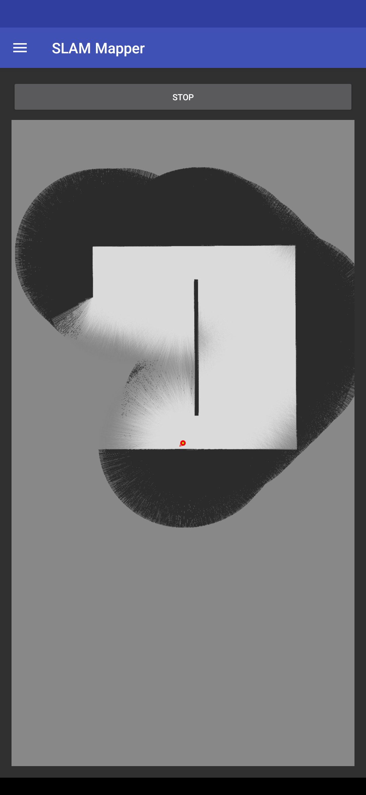
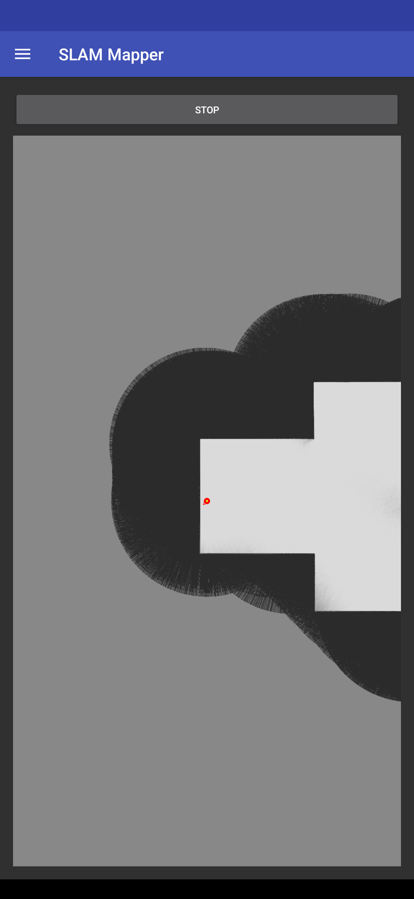

# EV3 Projects for Android (lejos edition)

When implementing mapping functionality in my previous EV3 project ([here](https://github.com/Anty0/ev3projects-lejos)) I found out that the EV3 brick was not powerful enough to handle the workload. Especially limiting was limited RAM. So I decided to make an Android device the brain of operations and use the EV3 brick for processing quick responses to environment changes (reflexes) and otherwise just act as a client to the Android device. I also had some ideas for the app, for example I wanted to make it possible to describe the robot's model in the app and have the EV3 program automatically adjust its behavior based on the model (model = the wheel diameter, distance between wheels, etc.), but I never got to implementing that.

In the end I had a working prototype that could map a room in simulation, but it never worked in real life. Mainly because of two reasons:

- The navigation system was limited to a grid and could only move in straight lines and 90 degree turns. That compounded with the fact that to avoid getting close to walls the navigation was making a lot of 90 degree turns, which made the driving so inaccurate that the algorithm was not able to keep track of the robot's position. I tried to fix this by implementing a "shortcuts" where the robot would skip some grid cells and go straight to one of the cells that are further away, as long as there was acceptable certainty that the robot would not hit a wall. This worked to some extent, but the inaccuracy of the lego motors was still too much to keep the robot on track.
- Accuracy of the infrared sensor (I don't have the ultrasonic sensor) was not good. The sensor does measure amount of reflected light which can help with measuring proximity but to use such data for SLAM... There is probably a way to do this, but it would likely involve playing with touch sensor to detect walls that even when close to the IR sensor won't get detected and calibrating the odometry to be as accurate as possible to avoid position drift over time since the IR sensor is very good for correcting the robot position.

Aside from Mapper, the rest of the modes are just a copy (possibly with some modifications) of the versions in the previous project, but their controls on the Android app are mostly unimplemented so they cannot be started from the user interface.

Here are some screenshots of the Mapper in action (environment is simulated):

## Building

There are two parts to this project: the Android app and the EV3 program. You don't need to build the EV3 program to run the Android app - there is a simulator in the Android app that can be used to access the Mapper mode (leave "IP Address" empty to use the simulator), but you will need to build the EV3 program to run the other modes or to run the Mapper mode on the EV3 brick.

### Android app

The Android app is built using Android Studio. You can open the project in Android Studio and build it from there. There may be some issues with the project since it is quite old.

### EV3 program

You can build the EV3 program similarly to the previous project ([here](https://github.com/Anty0/ev3projects-lejos)). One difference is that this time the project is built using Java 8 instead of Java 7.
